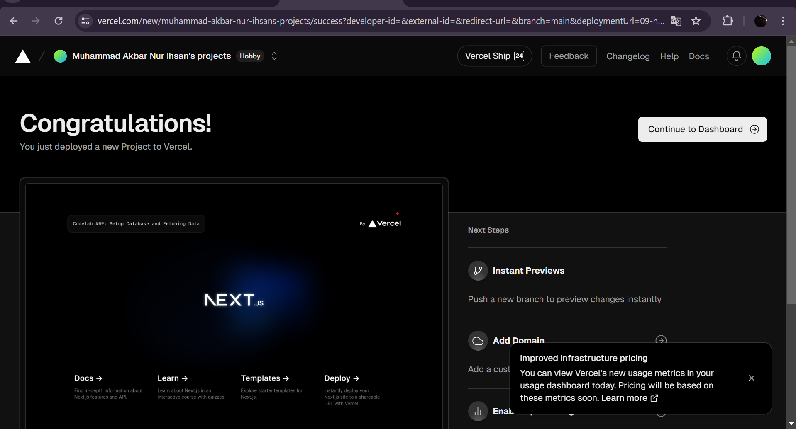
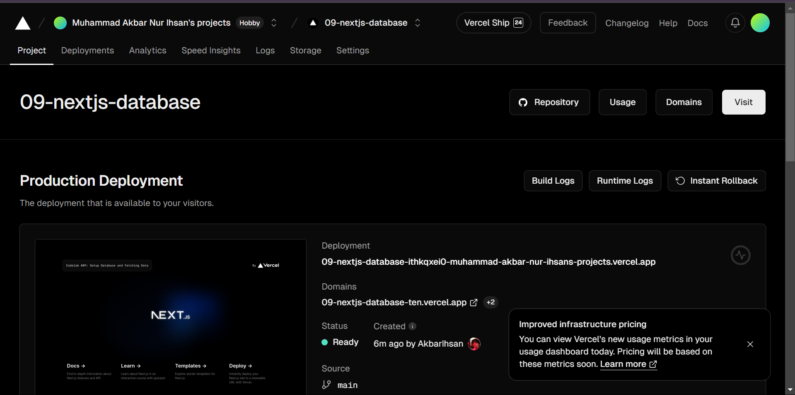
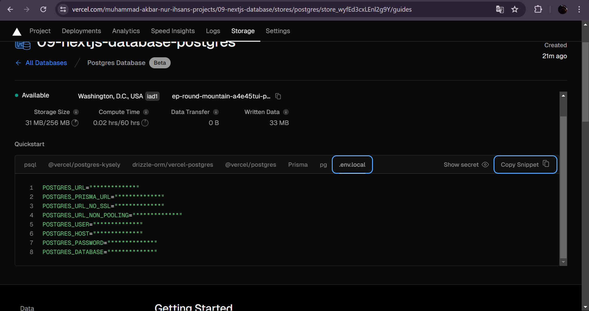
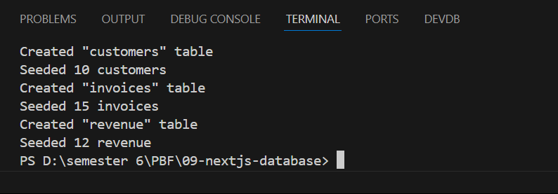
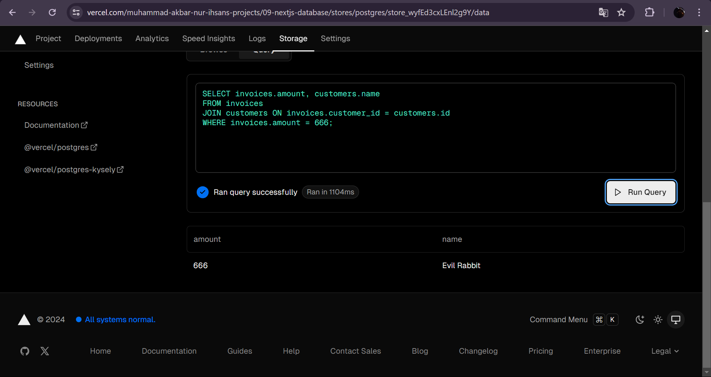
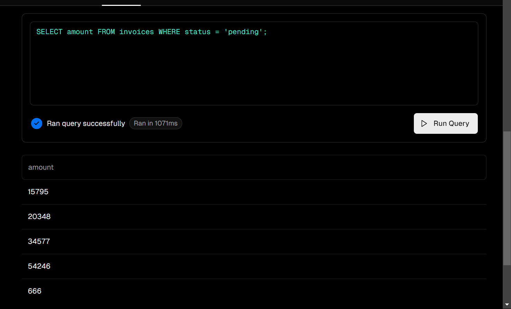

|  | Pemrograman Berbasis Framework 2024 |
|--|--|
| NIM |  2141720225|
| Nama |  Muhammad Akbar Nur Ihsan |
| Kelas | TI - 3A |

1. screenshot
    
    
2. yang sudah saya pelajari dari praktikum diatas adalah bagaimana cara membuat database postgres. kemudian mengetahui bagaimana caranya menginstall vercel postgress SDK.
        
3. yang saya pelajari dari praktikum diatas adalah bagaimana langkah langkahnya cara membuat seeder dan meng seed ke database 
        
4. 

saya ingin melihat amount dengan status pembayaran yang pending.